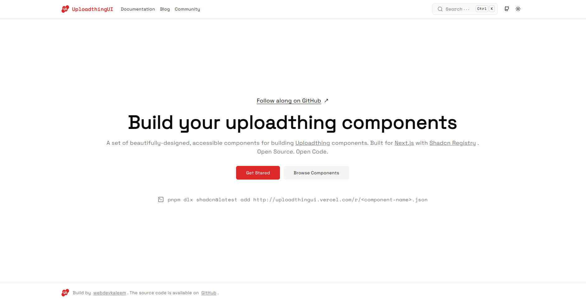

# Uploadthing UI

---

A set of beautifully-designed, accessible components for building [Uploadthing](https://uploadthing.com) components. Built for [Next.js](https://https://nextjs.org) with [Shadcn Registry](https://ui.shadcn.com/docs/registry) . Open Source. Open Code.

 

## Documentation

Visit [https://uploadthingui.vercel.app](https://uploadthingui.vercel.app) to view the documentation.

 

## Contributing

Please read the [contributing guide](./CONTRIBUTING.md).
